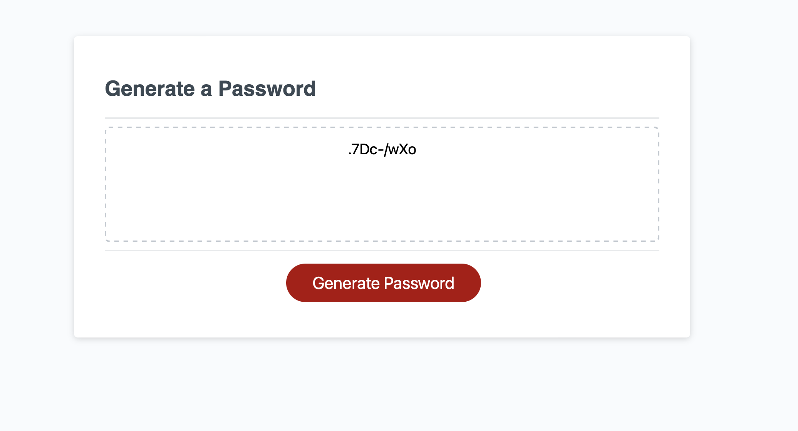
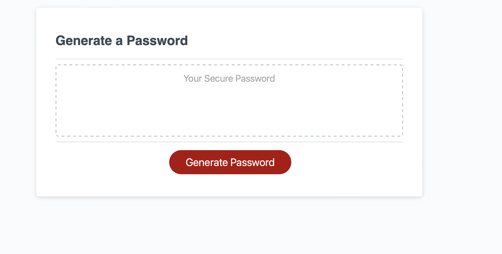
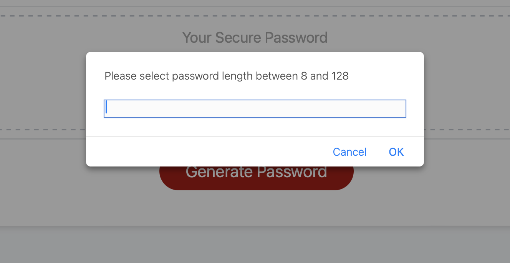
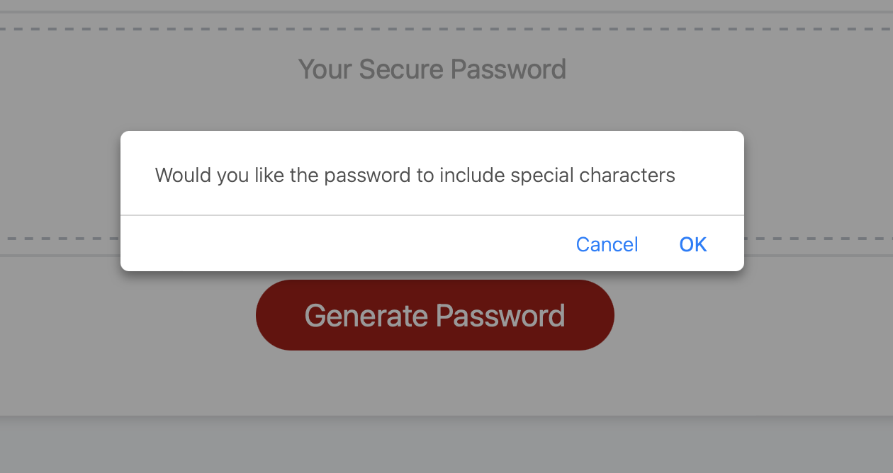
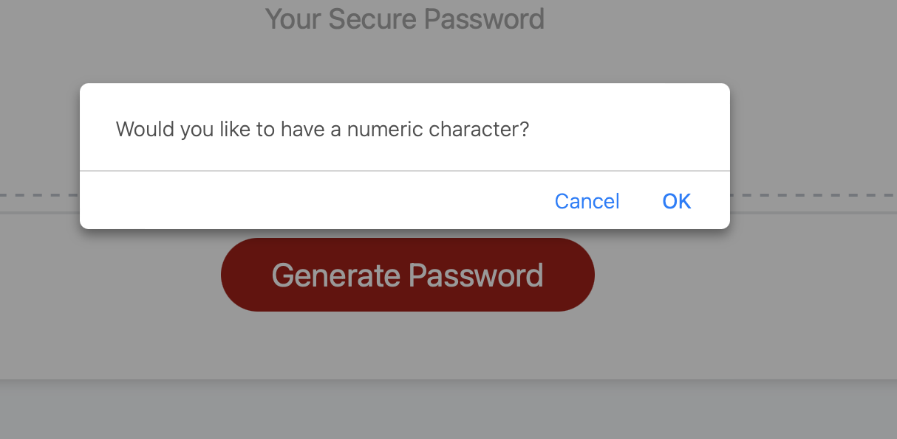
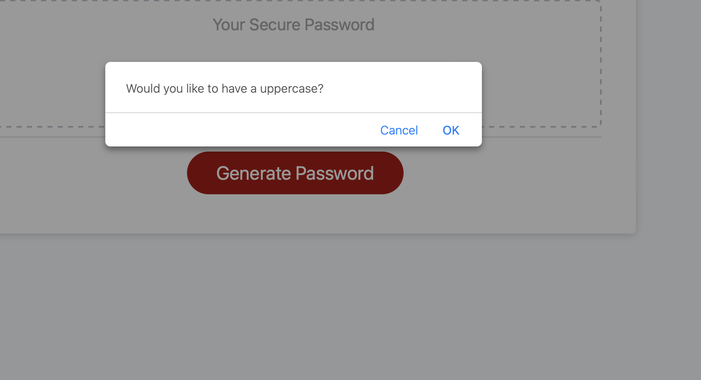
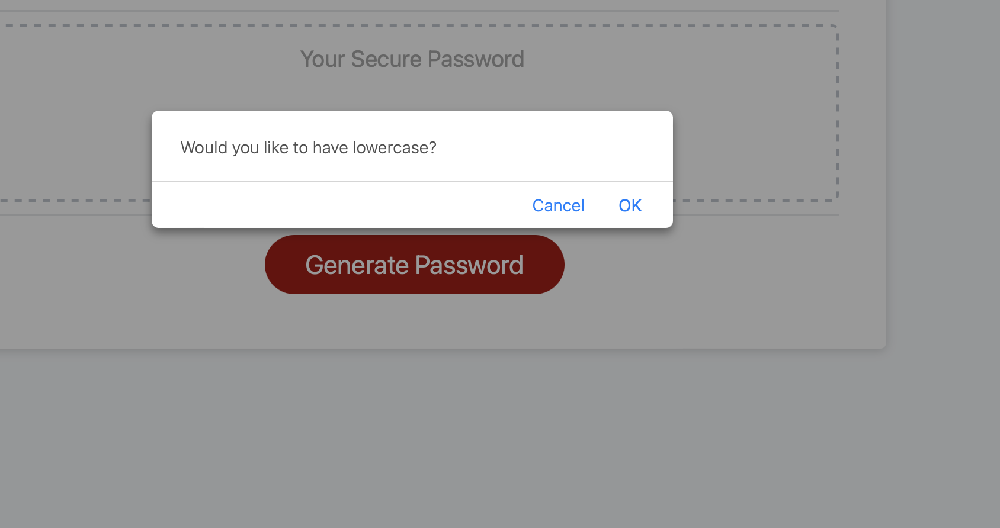
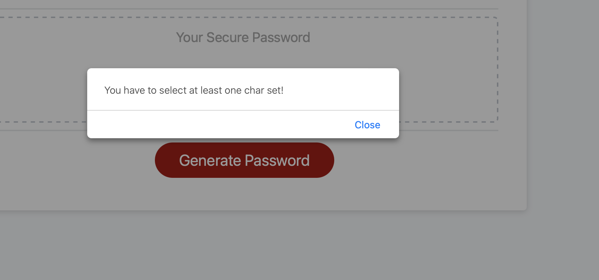

# Random-Password-Generator

## Description

JS script that generates a random password based on user preference.

## Installation

N/A

## Usage

Link to application: https://fumitsukai.github.io/random-password-generator/

Click on the Generate password to start creating a password.

Pick a size between 8 and 128 characters.

Choose whether it has special characters.

Choose whether it has numeric characters.

Choose whether it has uppercase characters.

Choose whether it has lowercase characters.

You will have to pick at least one set of characters.

## Credits

N/A

## License

Refer to licence is the repo.